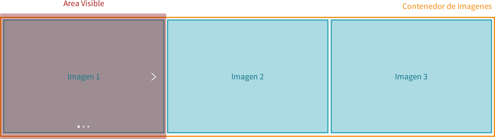
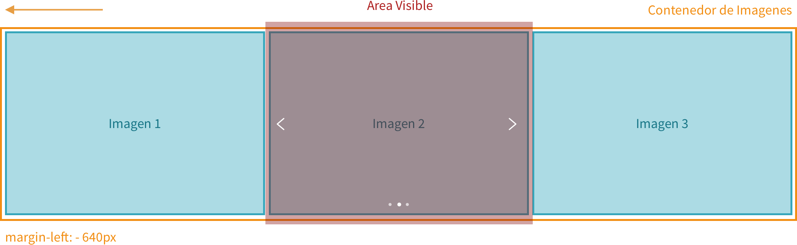

# Carrusel de Imagenes

El objetivo es crear un slider de imágenes donde:

- Al hacer click en la flecha del lado derecho o del lado izquierdo se muestre la siguiente imagen o la anterior según corresponda.
- Los puntos de navegación que se muestran en la parte inferior del slider deberán actualizarse para indicar cual es la imagen que se está mostrando
- Al hacer click en los puntos de navegación, el slider también deberá de ir a la imagen correspondiente.
- La flecha derecha deberá de ocultarse si la imagen activa es la última disponible. De igual manera, la flecha izquierda deberá de ocultarse si la imagen activa es la primera disponible.

### ¿Cómo está estructurado el slider?

El slider esta compuesto de la siguiente forma:

- El elemento `.slider` determina el area visible del slider. Tiene una propiedad en sus estilos `overflow: hidden` que hace que todo lo que esté dentro del elemento pero fuera del area visible será escondido.

- El elemento `.slider-slides-wrapper` es el contenedor de las imagenes. Tiene la misma altura que el slider. Este es el elemento que hay que desplazar (utilizando la propiedad `margin-left`, que también puede ser negativo)

- Los elementos `.slider-slide` son contenedores de la imagen. Estos tienen las mismas dimensiones que `.slider` para asegurarnos que una sola imagen pueda estar visible a la vez.
